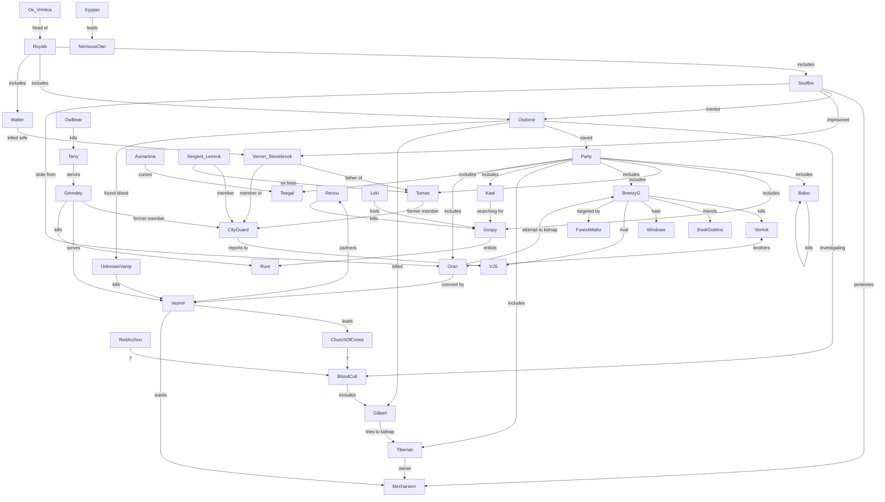

# Knowledge Graph
Around session 14 the party describes a relationship graph between known entities in the campaign thus far.

## Live Link
[Mermaid Live](https://mermaid.live/edit#pako:eNqFVttuGzcQ_RWCQJ4iGbr5IiFIYSuNgDSuC8tVimIBg9qdlQjxsiC5ljeG_71DcrWmUqWFH-zlOXPhzJmhX2iuC6AzujGs2pKHT5l69478wYxriAS5BmMzFT_7fa5yURdg-_2PN0xofRJZaF01J5EHLdlPvBmA783itBXHJDhTJ8HfGIjTVgAbdhq6M96Z_8GbXuesANmQ9-ReN0xgektdi5IbQKNKW7A2GJFbyLdMcSuPGBKU08bjd7bQkptMRT_HIQ8Wp9H_NCXfmHBgjqJyWRlutYLCE1ZgjFaPS4cHa6P17ohrnRZASqNlyDLcvQ0YAj2BdXzDHFcb3wjsajGvhUtJlj2FSKGWmeo4P_SdC2wUGrZ_IOoMB0ucJjteKFYdNfPOPq4MV47nDJlbYAXRJTIObbiH4trkW60Q_cWnnqQWOveZSS4wHX99nu_Ih34fb--2qNiuyf8qDTormefEYKSVZHA439YYEAEyN3qPp94HGuQaTA4FWXsdfVxBE3r1gK79gQWDJfTIwnBpBTSnw8ZhasPOuWsWNTMFVqu18plpI5ESmT_Q2lyYcyAr91ZTkk5P4iumleR7D0rXvkgVdlHFIpED2BbUMcEdtgx7HF2iox0Xwh5khnU-eEqQduKT6B10XysvpT0qgpkUCOVLReaRoLJOR1H4HUT2vISf6D1so8R9u53CtW58_Rd6LbiyPbL6suyReDtyk96zRK2qIuTmLVqDlLFlLsT_xlUR9PEGGf7ERMjtyzI9d8xswAXtePRzs8cK3rKSs0NyXtQkDBNTBVkxWeHY2rQwpa4RWXui9_Gn2im9V56ZqeTjuFWxrfE3IgLHKyBR43dlq_BM_dU0FXtOKb9r3C15becirsnQXSSAEty6pKuZurYSxcSVn-C8NvZo8-KI-OE6oetE1kswG6bc41eQpn4bk_8hwTNZa5s8KR3Z9wIqbVxYO17-viGZ-qp3PGSiRfJGHbYRIgTLGOIme74rH9lj-DDjCZop__iEUWNYU9yfpAxPQev8qNTtEut2GO3hg8sLOnOmhh7F8kjmP-lLpgjJKK4oCRmd4Z8FlMxvPdqLkGCNrl3EQOwymqlXdFcx9bfW8uDR6HqzpbMSdyl-1VWB4v3EGb7yHSUe_lpwfME6psEhADNHzTk6u7iYXgXPdPZCn-msPx2en02m48FkOJ2OhleX5z3a4PF4cH42uhhcjceXk8FoPJm89uj3kMzwbHo1HJ1PLod4PBoMLyc9CiHibfy3I9eq5Bv6-g9UC_W1)

Backup (doesn't render properly on wikijs):

