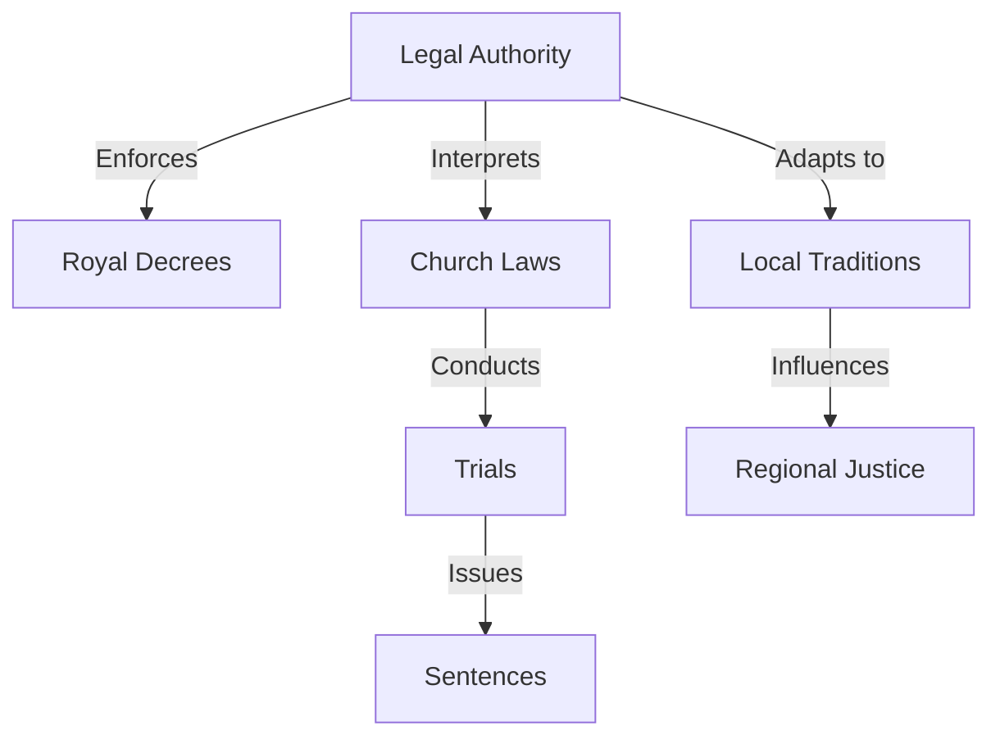
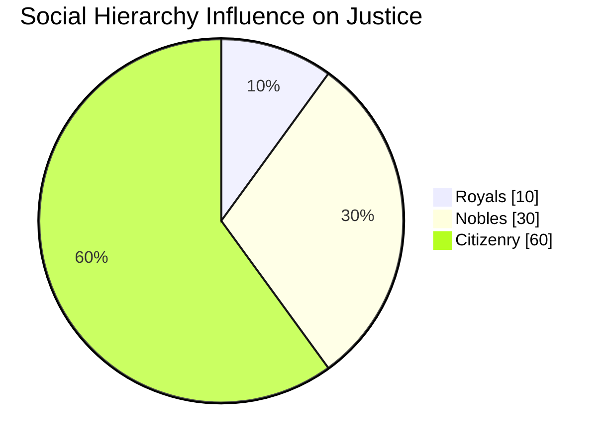
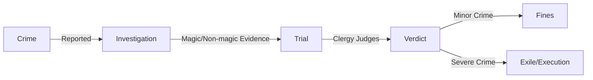

# Vrintia Legal System

| Aspect              | Description |
|---------------------|-------------|
| **Government**      | Dynastic theocracy founded by Os, blending royal decrees, church authority, and local traditions. |
| **Legal Authority** | Unified courts, clergy, and bureaucracy enforcing laws based on Os’s vision. |
| **Judicial Process** | Crimes are reported, investigated (often using magic), and tried by the Church. |
| **Social Tiers**    | Royals (Os’s descendants), nobles (RVASSS-trained magic users), and citizenry. |
| **Major Laws**      | No weapons in the capital, no dark magic, no heresy against Os. |
| **Punishments**     | Varies from fines to imprisonment, exile, or execution, depending on crime severity and social status. |
| **Conflict Resolution** | Clergy officiate disputes, nobles have legal advantages, and crimes against the state face severe punishment. |
| **Legal Codices**   | Sacred laws written by Os, post-Os laws, and updates from the Clergal Conclave. |
| **Magic Regulation** | Overseen by RVASSS, restricting dark magic and ensuring lawful magical use. |

## Legal System Overview

## Social Structure and Justice System

## Crime and Punishment Flow

