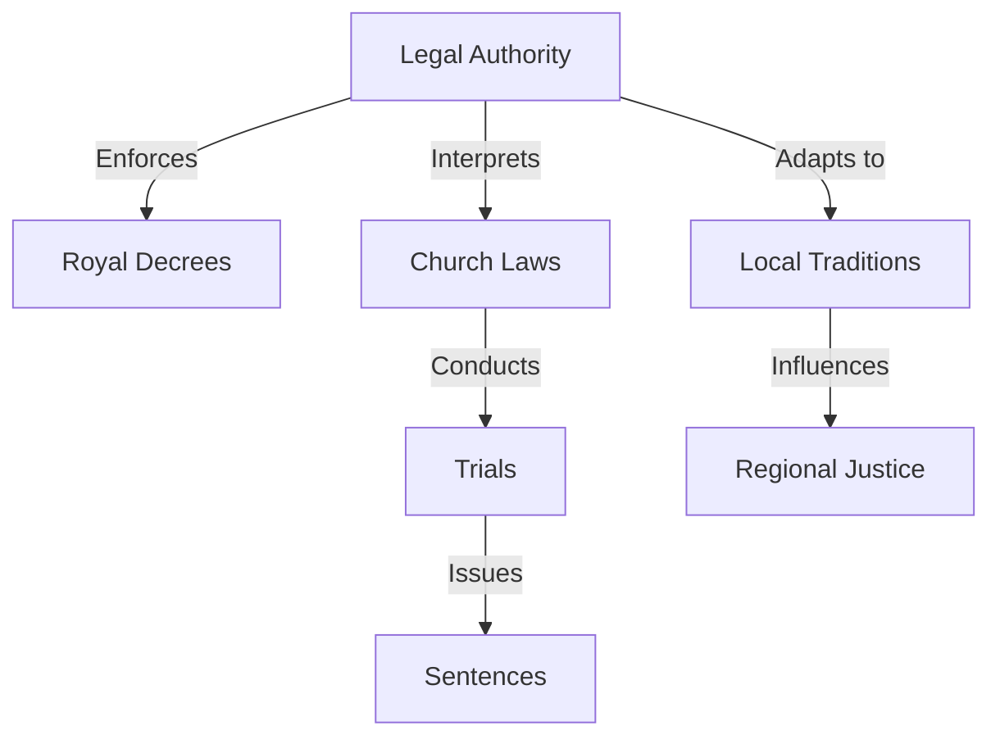
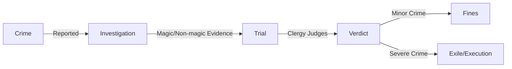

# Vrintia Legal System Overview

The Kingdom of Vrintia operates under a dynastic theocracy founded by Os, a divine godking whose laws and legacy shape the realm. The legal system blends royal decrees, church authority, and local traditions, with a strong emphasis on maintaining order and devotion to Os. Courts, clergy, and bureaucracy are unified, enforcing laws that reflect Os’s vision of an egalitarian yet authoritarian society.

## Core Principles

- **Circumstance and Precedence:** Laws adapt to local conditions, but Os’s statutes remain supreme within the capital.
- **King's Law vs. Local Law:** The further from the capital, the more local traditions influence justice, though still guided by Vrintian ideals.
- **Magical Authority:** The Head of the Royal Vrintia Academy of Swords, Song, and Sorcery (RVASSS) regulates magic use.
- **Judicial Unity:** Courts are part of the Church, handling everything from fines to marriages.

## Social Tiers

- **Royals:** Os’s descendants, including the “dwelf” noble houses (dwarf-elf hybrids).
- **Nobles:** Trained at RVASSS in utility magic (e.g., *Plant Growth*, *Fabricate*).
- **Citizenry:** Common folk, bound by stricter laws but with some rights under Os’s egalitarian ideals.

## Major Laws

- **No Weapons in the Capital:** Strictly enforced to maintain order.
- **No Dark Magic:** Necromancy, demon summoning, and blood magic are banned, except for rare Church-approved necromancy.
- **No Heresy Against Os:** Questioning Os’s divinity or authority is a grave offense.

## Judicial Process

1. **Reporting:** Crimes are reported to local guards or constabulary.
2. **Investigation:** Mage priests may use divination or magical evidence.
3. **Trial:** The Church conducts trials to determine guilt.
4. **Rights:** Fair trial and counsel (via clergy) are granted to believers in Os with good standing.
5. **Punishment:** Based on crime severity and social standing.

## Punishments

### Mundane Crimes (e.g., theft):
- Imprisonment
- Fines
- Death (rare)
- Rehabilitation

### Magical/Major Crimes (e.g., murder, dark magic):
- Imprisonment with anti-magic defenses
- Exile or execution for severe cases

## Conflict Resolution

- **Citizen vs. Citizen:** Guards handle, clergy officiates.
- **Citizen vs. Noble:** Nobles have the advantage; outcomes favor their status.
- **Noble vs. Noble:** Church officials adjudicate strictly by legal codices.
- **Citizen/Noble vs. State:** Seen as offenses against Os; harsher penalties (treason for nobles).
- **Foreigner vs. Anyone:** Treated like citizens but denied bail; risk exile or ransom.

## Legal Codices

- **Os’s Laws:** Sacred texts written by Os and his advisors, revered as divine.
- **Post-Os Laws:** Written after Os’s disappearance, less venerated but still binding.
- **Clergal Conclave:** Convenes periodically to review and update laws.

## Notable Exceptions

- **Extraordinary Circumstances:** Rules may bend in crises (e.g., war, cult attacks).
- **Duke of Arnsworth:** Semi-autonomous, blends Vrintian law with local customs.
- **Loopholes:** Enforced rigorously, often exploited by nobles or bureaucracy.

## Church and Magic

- **Church Role:** Unified with courts and bureaucracy; performs marriages, deaths, and fines.
- **Magic Regulation:** RVASSS oversees magical training and bans dark arts.
- **Os’s Divinity:** Supreme authority, reinforced by sacred texts chronicling his actions.

# Vrintia Legal System

| Aspect              | Description |
|---------------------|-------------|
| **Government**      | Dynastic theocracy founded by Os, blending royal decrees, church authority, and local traditions. |
| **Legal Authority** | Unified courts, clergy, and bureaucracy enforcing laws based on Os’s vision. |
| **Judicial Process** | Crimes are reported, investigated (often using magic), and tried by the Church. |
| **Social Tiers**    | Royals (Os’s descendants), nobles (RVASSS-trained magic users), and citizenry. |
| **Major Laws**      | No weapons in the capital, no dark magic, no heresy against Os. |
| **Punishments**     | Varies from fines to imprisonment, exile, or execution, depending on crime severity and social status. |
| **Conflict Resolution** | Clergy officiate disputes, nobles have legal advantages, and crimes against the state face severe punishment. |
| **Legal Codices**   | Sacred laws written by Os, post-Os laws, and updates from the Clergal Conclave. |
| **Magic Regulation** | Overseen by RVASSS, restricting dark magic and ensuring lawful magical use. |

## Legal System Overview

## Crime and Punishment Flow

